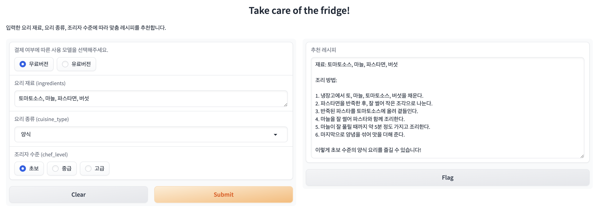
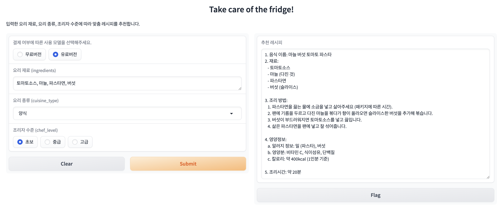

# 🥗 냉장고를 부탁해 (Take care of the fridge)

냉장고에 있는 재료로 요리를 만들고 싶다! 간단한 레시피가 없을까? 🤔

**'냉장고를 부탁해'**는 이러한 고민을 해결해드립니다^3^ 수준에 맞는 간단한 레시피를 추천받아보세요! 🍳

---

## 📚 목차

- <a href="#required-packages">필요한 패키지 모듈 설치 및 버전</a>
- <a href="#vicuna-gpt-api">Vicuna/GPT API 가져온 코드 설명</a>
- <a href="#functions">Vicuna/GPT API 사용하여 작성한 함수 설명</a>
- <a href="#gradio">Gradio 설명</a>
- <a href="#execution">실행 (Local/Public 서버)</a>
- <a href="#execution-examples">실행 예시</a>
- <a href="#license">License</a>

---

<h2 id="required-packages">📦 필요한 패키지 모듈 설치 및 버전</h2>

```bash
pip install transformers gradio openai torch
```

- **Transformers**: `transformers` 라이브러리는 Vicuna 모델 사용에 필요합니다.  
    Version: `4.46.2`
- **Gradio**: 간편한 웹 인터페이스 구축을 위해 사용합니다.  
    Version: `4.44.1`
- **OpenAI**: ChatGPT API 연동에 필요합니다.  
    Version: `0.28.0`


---

<h2 id="vicuna-gpt-api">🧠 Vicuna/GPT API 가져온 코드 설명</h2>

### 1️⃣ Vicuna 모델

- **오픈소스 사용**: [lmsys/vicuna-7b-v1.5](https://huggingface.co/lmsys/vicuna-7b-v1.5)
- **코드**:

```python
from transformers import AutoTokenizer, AutoModelForCausalLM
import torch

# 모델과 토크나이저 로드
tokenizer = AutoTokenizer.from_pretrained("lmsys/vicuna-7b-v1.5")
model = AutoModelForCausalLM.from_pretrained("lmsys/vicuna-7b-v1.5")

# 모델을 GPU로 이동
device = "cuda" if torch.cuda.is_available() else "cpu"
model = model.to(device)
```

### 2️⃣ ChatGPT API (4.0-mini)

- **API 키 사용**:

```python
import openai

# OpenAI API 키 설정
openai.api_key = ""  # 자신의 OpenAI API 키를 입력하세요.
```

---

<h2 id="functions">🛠 Vicuna/GPT API 사용하여 작성한 함수 설명</h2>

### 1️⃣ `Vicuna_2a.py`에서 작성한 `def generate_recipe(ingredients, cuisine_type, chef_level)` 함수 설명

- **입력**: 재료 목록, 요리 종류, 조리자 수준
- **출력**: 추천 레시피 (재료 및 조리방법)

### 2️⃣ `Gpt_4a.py`에서 작성한 `def get_recipe(ingredients, cuisine_type, chef_level)` 함수 설명

- **입력**: 재료 목록, 요리 종류, 조리자 수준
- **출력**: 추천 레시피 (재료, 조리방법 및 시간, 영양정보)

---

<h2 id="gradio">🌐 Gradio 설명</h2>

**Gradio**는 머신러닝 모델 및 API를 간편하게 웹 환경으로 배포할 수 있는 Python 패키지입니다.

### 1️⃣ 패키지 Import

```python
import gradio as gr
```

### 2️⃣ Gradio 인터페이스 정의

```python
iface = gr.Interface(
    fn=choose_model,
    inputs=[
        gr.Radio(choices=["무료버전", "유료버전"], label="결제 여부에 따른 사용 모델을 선택해주세요.", value="무료버전"),
        gr.Textbox(label="요리 재료 (ingredients)", placeholder="예: 계란, 우유, 당근"),
        gr.Dropdown(choices=["한식", "중식", "양식", "디저트"], label="요리 종류 (cuisine_type)", value="한식"),
        gr.Radio(choices=["초보", "중급", "고급"], label="조리자 수준 (chef_level)", value="초보")
    ],
    outputs=gr.Textbox(label="추천 레시피"),
    title="Take care of the fridge!",
    description="입력한 요리 재료, 요리 종류, 조리자 수준에 따라 맞춤 레시피를 추천합니다."
)
```

- **`choose_model`**: 결제 여부에 따라 Vicuna(무료버전) 또는 ChatGPT(유료버전) 선택.

---

<h2 id="execution">🚀 실행 (Local/Public 서버)</h2>

### 1️⃣ Local 서버

```python
iface.launch()
```

- 실행 즉시 Local 서버가 생성됩니다.
- 예: http://127.0.0.1:7860/

### 2️⃣ Public 서버

```python
iface.launch(share=True)
```

- 실행 즉시 Public 서버로 배포 가능합니다.
- 예: https://take-care-fridge.gradio.app

---

<h2 id="execution-examples">📸 실행 예시</h2>

### 1️⃣ Vicuna (무료버전) 결과 예시


### 2️⃣ ChatGPT (유료버전) 결과 예시


---
<h2 id="license">📜 License</h2>

[MIT License](LICENSE)

- 자유롭게 수정 및 배포 가능합니다.
